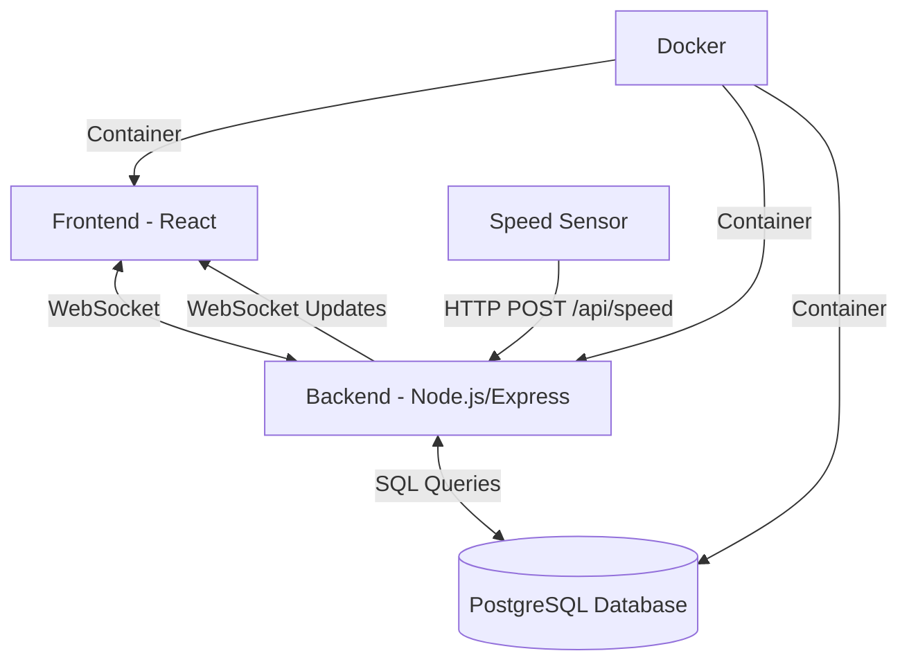

# Real-time Speedometer Application

A real-time speedometer application that displays speed data from a sensor, stores it in a database, and updates the UI in real-time using WebSockets.

## Architecture



## Prerequisites

- Docker and Docker Compose
- Node.js (for local development)
- npm or yarn

## Getting Started

### With Docker (Recommended)

1. Clone the repository
2. Create a `.env` file in the backend directory:
   ```
   PORT=5000
   DATABASE_URL=postgres://postgres:postgres@db:5432/speedometer
   NODE_ENV=development
   ```
3. Run `docker-compose up --build`
4. Access the application at `http://localhost:3000`

### Local Development

#### Backend
1. Navigate to the backend directory
2. Install dependencies: `npm install`
3. Start the server: `npm run dev`

#### Frontend
1. Navigate to the frontend directory
2. Install dependencies: `npm install`
3. Start the development server: `npm start`

## API Endpoints

- `POST /api/speed` - Submit a new speed reading
  - Body: `{ "speed": number }`
- `GET /api/speed/history` - Get speed history
  - Query params: `limit` (default: 100)
- `WS /ws` - WebSocket endpoint for real-time updates

## Project Structure

```
speedometer-app/
├── backend/               # Node.js/Express server
│   ├── src/
│   │   └── server.js      # Main server file
│   ├── .env.example       # Example environment variables
│   └── package.json
├── frontend/              # React frontend
│   ├── public/
│   └── src/
│       ├── components/    # React components
│       └── App.js         # Main App component
├── docker-compose.yml     # Docker Compose configuration
└── README.md              # This file
```

## Testing

Run tests with:

```bash
# Backend tests
cd backend
npm test

# Frontend tests
cd frontend
npm test
```

## Running Tests

### Backend Tests
```bash
cd backend
npm install
npm test

## License

MIT
